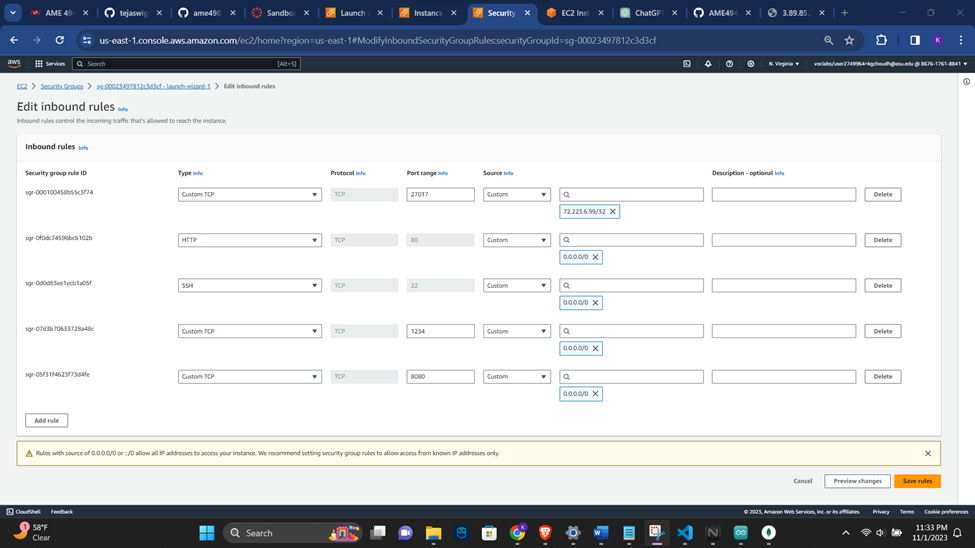
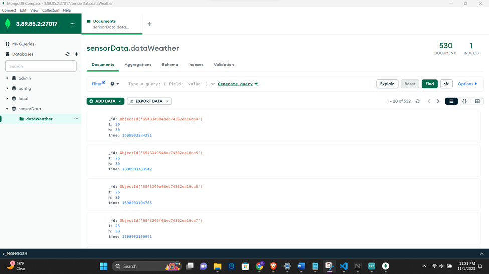
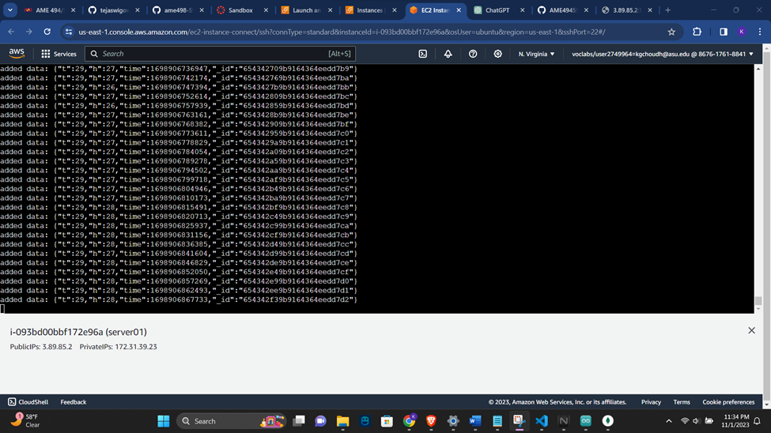
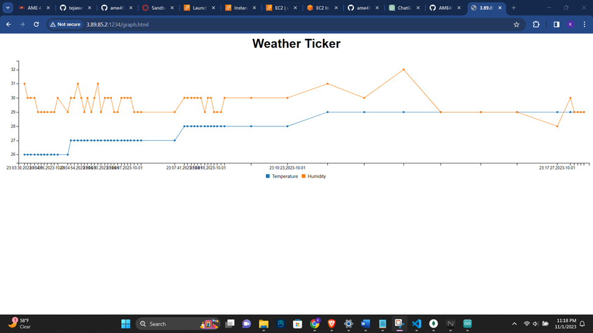

# Assignment 5: Weather Station with HTTP Send Interval

## Overview
This project sets up a weather station using an ESP32, an EC2 server, and a web interface to display sensor data. The Arduino code sends data every 5 seconds using `millis()` instead of `delay()`.

## Quick Setup
1. **Start AWS Lab**: Launch an Ubuntu 20.04 EC2 instance.
   - Select server name
   - Select OS - ubuntu 20.04
   - Key pair – proceed without key pair
   - Configure storage – 1 * 28
   - Launch instance
2. **Edit Security Rules**: Add TCP ports 27017, 8080, 1234, and HTTP with the specified IP addresses.
   - Add TCP port no: 27017 --> Choose IP address as my own IP
   - Add TCP port no: 8080 --> Choose IP address as 0.0.0.0/0
   - Add TCP port no: 1234 --> Choose IP address as 0.0.0.0/0
   - Add HTTP --> Choose IP address as 0.0.0.0/0
3. **Connect to EC2**: SSH into your EC2 instance.
4. **Install Node/Mongo**: Run the installation script and configure MongoDB.
  $ curl -s https://gist.githubusercontent.com/tejaswigowda/f289e9bff13d152876e8d4b3281142f8/raw/df37df2e16a3166e686357a045751a7c18bbeebe/installNodeMongoUbuntu16.04.sh | bash
  $ sudo nano /etc/mongod.conf # change the bind IP to 0.0.0.0, Port should be 27017
  $ sudo service mongod start
  $ sudo service mongod restart
5. **Clone Repo and Setup Server**: Clone the class repo, navigate to the server directory, and start the server.
   $ git clone https://github.com/tejaswigowda/ame498-598Fall2023.git
   $ cd ame498-598Fall2023/Weatherstation/server
   $ sudo nano server.js # Change port to 8080/1234
   $ node server.js
6. **Configure Arduino**: Update the Arduino code with your network details and upload it to the ESP32.
7. **Restart Services**: Restart MongoDB and the Node.js server.
   $ sudo service mongod restart
   $ node server.js
Access Web Interface: Open http://[your-ec2-ip-address]:[port number] in a browser.

**Screenshots**

Security Rules:
MongoDB Compass:
AWS Web Interface: 
Graph.html:

**Authors**
Ketan Choudhary

Please make sure to replace `[your-ec2-ip-address]` and `[port number]` with the actual values for your setup.